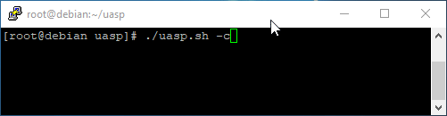

# UASP - Umod Autoupdate Script for Plugins




This script checks every plugin in your plugin folder.
It checks first if plugin exist on Umod, if not/using custom plugin, it will get a flag Umod=false.

* Get notify on discord when a new update is available or has been auto updated.
* Easy customize each plugin to enable/disable autoupdate.
* Auto sets custom plugins to IsUmod=false.

 Testet on Debian, Ubuntu and Centos 7.

# Linux
## Dependency that needs to be installed:
```
# Debian/Ubuntu
sudo apt install jq -y

Centos 7
sudo yum -y install https://dl.fedoraproject.org/pub/epel/epel-release-latest-7.noarch.rpm

sudo yum install jq -y
```

## For usage/documentation see wiki.

* [Wiki - Install/Usage](https://github.com/kennethrisa/uasp/wiki/Linux-Install---usage)
